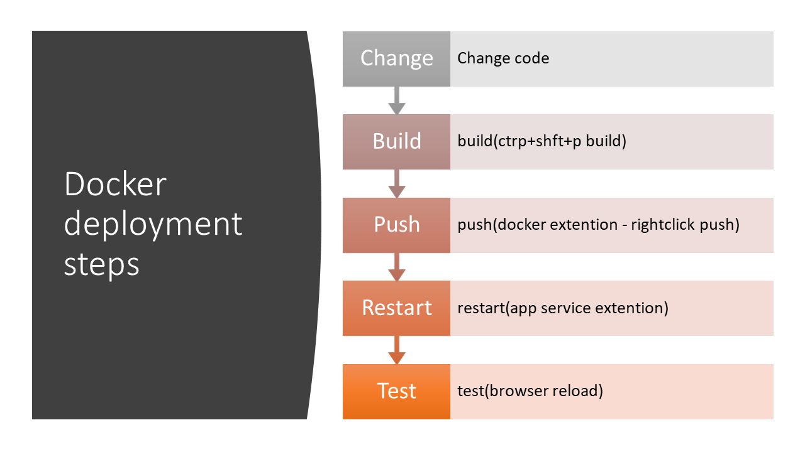

# Dockerflask
flask python web app using docker in azure app service.

# Prerequisites

1. Azure subscription and account
2. python 3.6 -  anaconda distribution
3. Visual studio code
4. Docker account
5. azure sql server database

Replace this in webapp.py with your info

	server = <database server>
	database = <database name>
	username = <user name>
	password = <password

# Testing locally
	set RUNENV=local
	
	conda create -n flask
	conda activate flask
	pip install -r requirements.txt
	python webapp.py

# Docker

Docker is useful for consistency in prod and local testing.
This is also useful if you want to install additional softwares/drivers in azure app service.

## Steps to deploying web application using docker into azure

steps

  1. Commands to test docker locally

docker build -f dockerfile --rm -t flaskwebapp:latest .
docker run -p 5000:5000 --rm flaskwebapp
docker ps
docker stop <CONTAINER ID>

      
  1. Commands to test docker locally
  
          docker build -f dockerfile --rm -t flaskwebapp:latest .
          docker run -p 5000:5000 --rm flaskwebapp
          docker ps
          docker stop <CONTAINER ID>

  2. Login to registry instance (docker hub or ACR) in local machine

  Tutorial : [Azure container service]

      	docker login --username <username> --password <password> <login server>

  3. Push docker image to azure container service

  Follow tutorial: [Azure container service]

          docker images
          docker push krishancontainerregistry.azurecr.io/myrepo/flaskwebapp:v1

  Right click. Run docker instance from the repo. I think it runs the docker instance in some shared resource. Use port 5000
  Ping does not work in docker (ICMP packet discarded). Try using telnet

  4. Azure app service using Docker images

  Followed tutorial  : [Sample tutorial using dockerhub]. 
  Push to azure container services instead of docker hub

  Define entry port to docker using **PORT** application setting. **PORT** is necessary to tell azure which port to connect to docker. 
  
  If I change it to 3000, this happens in app service logs.

          docker run -d -p 62348:3000 --name dockerflaskwebappkrishan_1 -e PORT=3000

  5. Visual studio code and docker azure app service Install docker extention.

  Tutorial: [Docker using visual studio code]

          ctrl+shift+P docker build
  or
          docker build --rm -f "Dockerfile" -t krishancontainerregistry.azurecr.io/myrepo/flaskwebapp:v1 .
  Run docker image as a container instance:
          docker run --rm -it -p 5000:5000 krishancontainerregistry.azurecr.io/myrepo/flaskwebapp:v1

  6. How to redeploy?

  Push docker image and restart app service.

  

# sql server integration issues and resolutions

SQL server works fine locally , but since azure app service for python and docker image used both are in Linux, additional drivers needed to be installed.

ODBC for ubuntu machine
https://www.microsoft.com/en-us/sql-server/developer-get-started/python/ubuntu/step/2.html

For debian 
install mysql drivers

    RUN curl https://packages.microsoft.com/keys/microsoft.asc | apt-key add - \
      && curl https://packages.microsoft.com/config/debian/9/prod.list > /etc/apt/sources.list.d/mssql-release.list \
      && apt-get update \
      && ACCEPT_EULA=Y apt-get install msodbcsql17 -y \
      && apt-get install unixodbc-dev

source:
https://docs.microsoft.com/en-us/sql/connect/odbc/linux-mac/installing-the-microsoft-odbc-driver-for-sql-server?view=sql-server-2017

SQL Alachemy config instruction:

https://stackoverflow.com/questions/4493614/sqlalchemy-equivalent-of-pyodbc-connect-string-using-freetds

## sql server using docker
SQL server works fine using flask web server in local machine and docker.
But once attached to UWSGI, it throws error

    pyodbc.Error: ('IM004', "[IM004] [unixODBC][Driver Manager]Driver's SQLAllocHandle on SQL_HANDLE_HENV failed (0) (SQLDriverConnect)")

Related link:
https://stackoverflow.com/questions/24444326/connecting-to-db2-databaseunixodbcdriver-managerdrivers-sqlallochandle-on

Fixed from uwsgi.ini remove

    uid = 1000

# Azure blob storage integration

Tutorial: [Azure blob storage in python]

# Appendix
[Sample tutorial using dockerhub]: https://www.jamessturtevant.com/posts/Deploying-Python-Website-To-Azure-Web-with-Docker/

[Docker using visual studio code]: https://code.visualstudio.com/docs/python/tutorial-deploy-containers

[Azure container service]: https://docs.microsoft.com/en-us/azure/container-registry/container-registry-get-started-portal

[Flask in visual studio code]: https://code.visualstudio.com/docs/python/tutorial-flask

[Sqlserver flask source code]: https://github.com/krkusuk/flask-sqlserver/blob/master/baselinewebapp/application.py

[Azure blob storage in python]: https://docs.microsoft.com/en-us/azure/storage/blobs/storage-quickstart-blobs-python
Useful command to generate requirements.txt
	
    pip freeze > requirements.txt

[Useful tutorial for custom docker images in azure]: https://docs.microsoft.com/en-us/azure/app-service/containers/tutorial-custom-docker-image

Folder structure is imprtant in python. Or it results in unexpected behaviour

Flask file structure demo
https://scotch.io/tutorials/getting-started-with-flask-a-python-microframework

